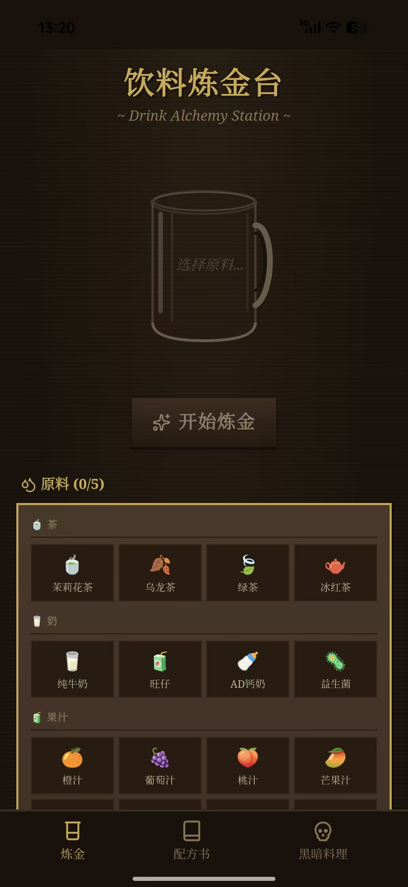
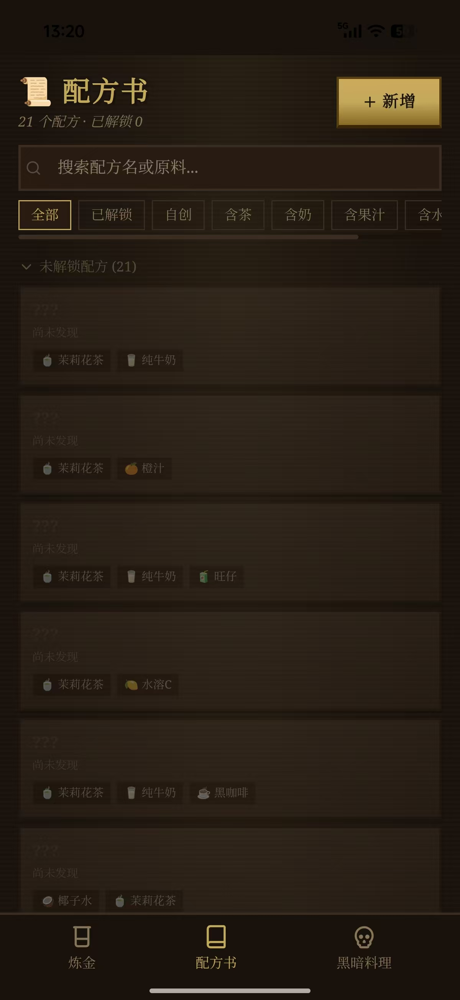
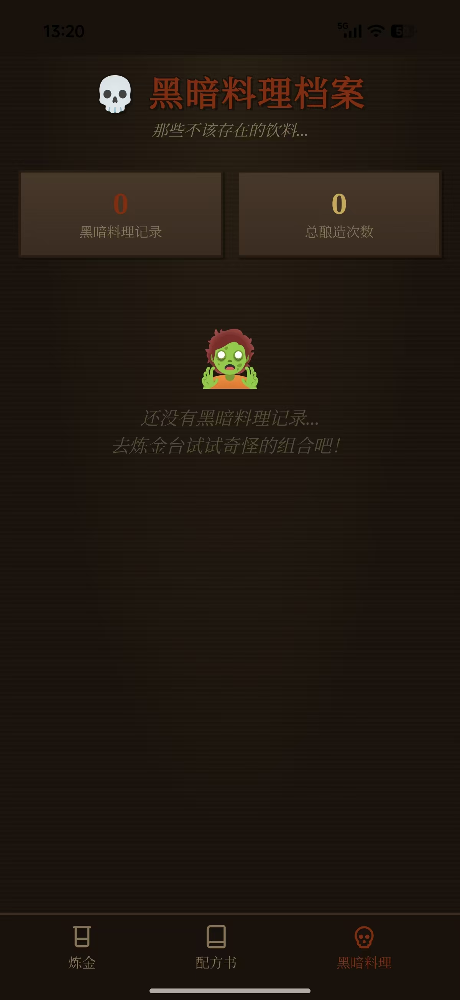

# 喵！炼金 🧪🐱

> 一款 Don't Starve 饥荒风格的饮料炼金小游戏喵～

## 在线喵一把

🌐 **https://ankesu.github.io/drink-lab/**

点开就能玩，手机电脑都能用喵。

## 这是什么喵？

这是一个「饮料炼金台」喵～

你可以挑选不同的原料丢进杯子里，摇一摇，看看能炼出什么神奇饮料喵。
- 配出**已知配方**会解锁到配方书喵～
- 失败的话会生成**黑暗料理**并被记录在案喵……
- 还能自己**添加、编辑、删除**配方喵！

## screenshot 喵

### 1. 炼金台


> 空杯待命，挑选原料，准备开始炼金喵！

### 2. 配方书


> 21 个隐藏配方等你发现喵，还能自创配方喵～

### 3. 黑暗料理档案


> 那些不该存在的饮料……小心别喝下去喵 🧟

## 怎么本地跑喵？

```bash
git clone https://github.com/ankesu/drink-lab.git
cd drink-lab
npm install
npm run dev
```

## 打包 APK 喵（Android）

```bash
npm install
npm run build
npx cap sync
npx cap open android
```

然后在 Android Studio 里：

```
Build → Clean Project
Build → Generate App Bundles or APKs → Generate APKs
```

## 技术栈喵

- React + Vite
- Tailwind CSS
- Framer Motion
- Capacitor（打包 APK）
- 本地 localStorage 存档

## 下载 APK 喵

直接仓库里找 `喵炼金.apk` 下载安装喵～

---

*喵～愿你的炼金永不黑暗 🐾*
